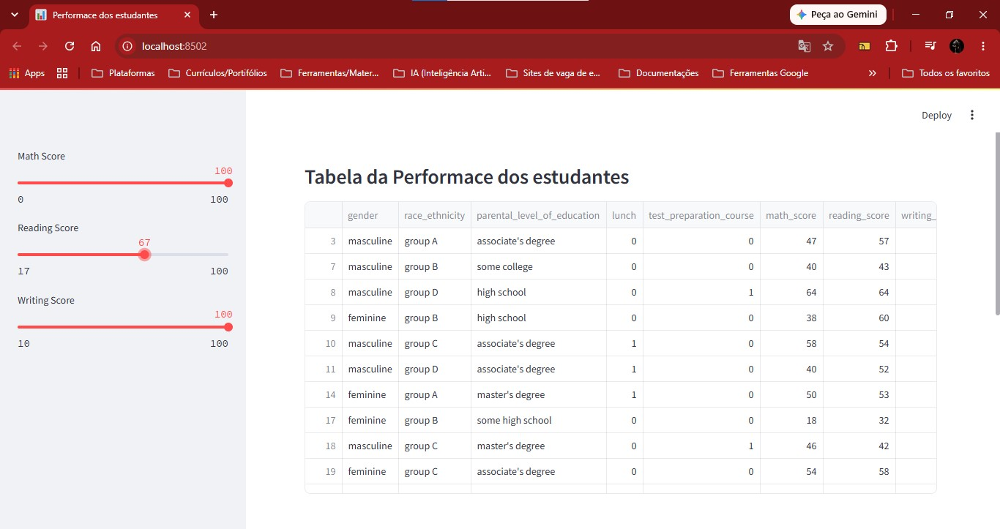

# Análises de dados sobre 'Performace de alunos' em Python

## Sobre o projeto

O projeto em si é um aplicativo web que analisa os dados da performace de alunos adquiridos na plataforma _[Kaggle](https://www.kaggle.com/datasets/muhammadroshaanriaz/students-performance-dataset-cleaned/data)_. Ele apresenta esses dados de forma organizada, por meio de uma tabela interativa e gráficos intuitivos, proporcionando uma visão abrangente e visualmente atraente através das pontuações de matemática, leitura e escrita de cada aluno.

---

## 🚀 Funcionalidades

- **Filtros Dinâmicos em Tempo Real:** 3 _sliders_ interativos para definição de faixas de notas em **Matemática** (_Math Score_), **Leitura** (_Reading Score_) e **Escrita** (_Writing Score_) pelo arquivo **.csv**, localizado na pasta _datasets_.
- **Tabela de Dados Filtrados:** Exibição detalhada dos alunos que cumprem os critérios selecionados nos filtros.
- **Gráficos de Distribuição:** Visualização gráfica interativa (utilizando Plotly) apresentando a contagem e distribuição das pontuações segmentadas por gênero (_masculino e feminino_).
  
  

---

## Tecnologias utilizadas

- **Python**: Ambiente de execução Python;
- **streamlit**: Biblioteca que transforma scripts de dados em aplicativos da web compartilháveis;
- **pandas**: Biblioteca para Python para manipulação e análises de dados
- **plotly**: Biblioteca responsável por criar gráficos interativos.

---

## Rodando localmente

Clone o repositório:

```bash
git clone https://github.com/SilvioNascimento/analises-de-dados-performace-de-alunos-python.git
```
  
Criar o Ambiente Virtual isolado:

```bash
python -m venv .venv
```

---

Ativar o Ambiente Virtual

```bash
.venv\Scripts\activate.bat
```

- **Verificação:** Se funcionou, seu terminal mostrará o prefixo (.venv) antes do caminho da pasta.

---

Instalar as bibliotecas que o projeto utiliza

```bash
pip install -r requirements.txt
```

---

Inicializando o _main.py_ ou pelo terminal:

```bash
streamlit run main.py
```

Ou executando pelo programa _runner.py_:

```bash
python runner.py
```

---

Desativar o Ambiente (no terminal)

```bash
deactivate
```
